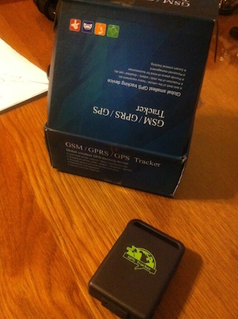

# gps-tracker

A simple UI for this:

Which is probably one of these 
[TK 102](http://www.ebay.com/sch/i.html?_odkw=GPS+tracker+TK&_osacat=0&_from=R40&_trksid=p2045573.m570.l1313.TR0.TRC0.H0.XGPS+tracker+TK+102.TRS0&_nkw=GPS+tracker+TK+102&_sacat=0)

It seems like you don't need  mobile apps [like this](http://www.starburstsoftware.co.uk/gpstracker/)

Instead let's build simple [interactive manual](http://ainthek.github.io/gps-tracker/www/index.html) ;-)

