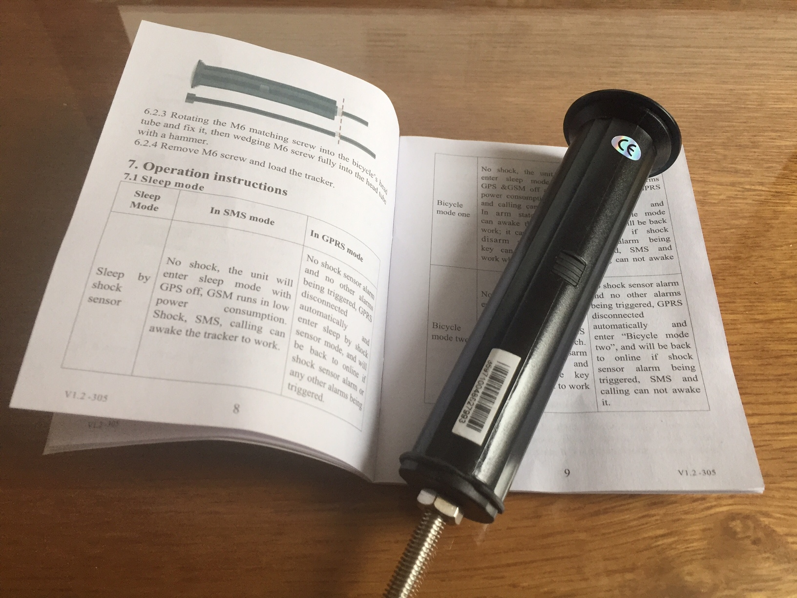

# gps-tracker

A simple UI for this:

## Model 1

Which is probably one of these 
[TK 102](http://www.ebay.com/sch/i.html?_odkw=GPS+tracker+TK&_osacat=0&_from=R40&_trksid=p2045573.m570.l1313.TR0.TRC0.H0.XGPS+tracker+TK+102.TRS0&_nkw=GPS+tracker+TK+102&_sacat=0)

It seems like you don't need  mobile apps [like this](http://www.starburstsoftware.co.uk/gpstracker/)

Instead let's build simple [interactive manual](http://ainthek.github.io/gps-tracker/www/index.html) ;-)

## Commands

as in manual, just rewritten to different syntax: 

	begin{password}								# 5.4 Initialization
	password{old-password} {new-password} 		# 5.5 Change the password
	admin{password} {phone-admin}				# 5.6 Authorization - add
	'call' {phone-device}						# 5.6 Authorization - add (another option)
	noadmin{password} {phone-admin}				# 5.6 Authorization - delete
	'call' {phone-device}						# 5.7 Single Location
	address{password}							# 5.8 Street Address			
	t{ttt}{u}{nnn}n{password}					# 5.9.1 Auto Track On, send message each {ttt} seconds, minutes, hours (s,m,h) {u}, send {nnn} messages
	t{ttt}{u}***n{password}						# 5.9.2 Auto Track On, send message each {ttt} seconds, minutes, hours (s,m,h) {u}, forever
	notn{password}								# 5.9.2 Auto Track Off
	monitor{password}							# 5.11 Monitor On (Voice Surveillance)
	tracker{password}							# 5.11.4 Monitor Off, back to tracker mode
	
## Model 2 (Bicycle Tracker GPS305, TK305)

Bought from here

<http://cgi.ebay.com/ws/eBayISAPI.dll?ViewItemVersion&item=281901546461&view=all&tid=1623772592018>

Battery Life Tests

- Mode - Sleep By Shock Sensor - 6 days (only!), almost no shocks, few messages
- Mode - bicycle 1 - TODO
- Mode - bicycle 2 - TODO
- Mode - Scheduled wake-up - ARM - TODO
- Mode - Scheduled wake-up - DISARM - TODO

Other:

- very bad plastic, hard to open, hard to close, hard to mount
- rubber seal broken after first mount/dismount
- charging outside of bike is nonsense, why not having connector and charge without dismounting ?  

My overview of modes can be found here: <./doc/modes.xlsx>
	

	
	

